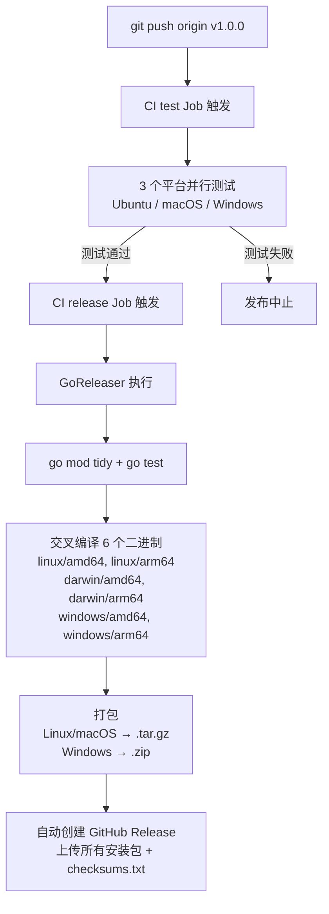

# CI/CD 使用指南

本文档说明项目中 CI/CD 配置文件的用途和使用方式。

---

## 文件概览

| 文件 | 用途 |
|------|------|
| `.github/workflows/ci.yml` | GitHub Actions CI 工作流，自动测试和发布 |
| `.goreleaser.yml` | GoReleaser 发布配置，定义跨平台构建和打包规则 |

---

## 1. GitHub Actions CI 工作流（`ci.yml`）

### 触发条件

- **push** 到 `main` 分支
- **pull_request** 目标为 `main` 分支
- **push tag**（`v*` 格式）触发发布流程

### Job 说明

#### Job 1: `test`（测试 & 构建）

- 在 **3 个操作系统**（ubuntu-latest、macos-latest、windows-latest）上并行运行
- 使用 Go 1.21
- 执行步骤：
  1. `go mod download` — 下载依赖
  2. `go test ./... -v -count=1` — 运行全量测试
  3. `go build -o github-buddy ./cmd/github-buddy/` — 构建二进制

#### Job 2: `release`（自动发布）

- **仅在推送 `v*` 格式的 tag 时触发**（如 `v1.0.0`）
- 依赖 `test` Job 通过后才执行
- 调用 GoReleaser 进行自动打包和发布

### 日常使用

**日常开发**：无需手动操作。推送代码或提交 PR 到 `main` 分支时，CI 自动运行测试。

**发布新版本**：通过打 Git tag 触发自动发布：

```bash
# 打标签
git tag v1.0.0

# 推送标签到远程仓库，触发发布流程
git push origin v1.0.0
```

> ⚠️ 发布需要仓库中配置 `GITHUB_TOKEN` secret（GitHub 默认已自动提供，无需手动配置）。

### 自动化发布流程图

推送 tag 后，GitHub Actions 会自动完成以下完整流程：



---

## 2. GoReleaser 发布配置（`.goreleaser.yml`）

GoReleaser 由上面的 `ci.yml` 在 `release` Job 中自动调用，负责跨平台构建、打包和发布。

### 核心配置

| 配置项 | 值 | 说明 |
|--------|----|------|
| `builds.main` | `./cmd/github-buddy` | 程序入口 |
| `builds.binary` | `github-buddy` | 输出二进制文件名 |
| `builds.goos` | linux, darwin, windows | 目标操作系统 |
| `builds.goarch` | amd64, arm64 | 目标 CPU 架构 |
| `builds.env` | `CGO_ENABLED=0` | 静态编译，无 C 依赖 |
| `builds.ldflags` | `-s -w -X main.version=...` | 编译时注入版本号、commit、日期 |

### 打包规则

- **Linux / macOS**：打包为 `.tar.gz` 格式
- **Windows**：打包为 `.zip` 格式
- 命名格式：`github-buddy_{版本}_{操作系统}_{架构}`

### 发布目标

- GitHub Release 页面：`eyjian/github-buddy`
- `draft: false` — 直接发布（非草稿）
- `prerelease: auto` — 自动识别预发布版本（如 `v1.0.0-beta.1`）

### Changelog 生成

自动生成变更日志，按提交信息排序，排除以下前缀的提交：
- `docs:` — 文档变更
- `test:` — 测试变更
- `ci:` — CI 配置变更

### 本地调试

通常不需要手动调用 GoReleaser，但如果需要本地测试构建流程：

```bash
# 安装 goreleaser
go install github.com/goreleaser/goreleaser@latest

# 本地模拟构建（不实际发布）
goreleaser build --snapshot --clean

# 本地模拟完整发布流程（不实际上传）
goreleaser release --snapshot --clean
```

---

## 3. 完整工作流程

```
日常开发：
  推送代码 / 提交 PR 到 main
      ↓
  CI 自动运行测试（3 个平台并行）
      ↓
  测试通过 → 代码合并
  测试失败 → 修复后重新提交

发布新版本：
  git tag v1.x.x && git push origin v1.x.x
      ↓
  CI test Job（测试通过）
      ↓
  CI release Job（调用 GoReleaser）
      ↓
  GoReleaser 构建 6 个平台二进制
      ↓
  自动创建 GitHub Release + 上传安装包
```

---

## 4. 发布到 GitHub Releases 详细指南

### 前置条件

1. 确保所有改动已提交并推送到 `main` 分支
2. 确保 `main` 分支上的测试是通过的
3. `GITHUB_TOKEN` 无需手动配置，GitHub Actions 会自动提供

### 发布步骤

#### Step 1：确保代码已就绪

```bash
# 确保所有改动已提交并推送到 main 分支
git add .
git commit -m "feat: xxx"
git push origin main
```

#### Step 2：打标签并推送

```bash
# 打版本标签（遵循语义化版本号 semver）
git tag v1.0.0

# 推送标签到 GitHub，自动触发发布流程
git push origin v1.0.0
```

#### Step 3：查看发布结果

发布完成后，访问 [https://github.com/eyjian/github-buddy/releases](https://github.com/eyjian/github-buddy/releases) 即可看到：

- 自动生成的 Release Notes（基于 commit 历史）
- **6 个跨平台安装包**：
  - `github-buddy_1.0.0_linux_amd64.tar.gz`
  - `github-buddy_1.0.0_linux_arm64.tar.gz`
  - `github-buddy_1.0.0_darwin_amd64.tar.gz`
  - `github-buddy_1.0.0_darwin_arm64.tar.gz`
  - `github-buddy_1.0.0_windows_amd64.zip`
  - `github-buddy_1.0.0_windows_arm64.zip`
- `checksums.txt` — SHA256 校验文件

### 版本号规范

| 格式 | 示例 | 说明 |
|------|------|------|
| `vMAJOR.MINOR.PATCH` | `v1.0.0` | 正式发布版本 |
| `vMAJOR.MINOR.PATCH-pre` | `v1.0.0-beta.1` | 预发布版本（自动标记为 Pre-release） |

> ⚠️ **Tag 格式必须以 `v` 开头**（如 `v1.0.0`），否则不会触发发布流程。

### 注意事项

1. **Tag 格式**：必须以 `v` 开头（如 `v1.0.0`），否则不会触发发布流程
2. **`GITHUB_TOKEN`**：无需手动配置，GitHub Actions 会自动提供
3. **预发布版本**（如 `v1.0.0-beta.1`）会被自动标记为 Pre-release（配置了 `prerelease: auto`）
4. **发布依赖测试**：`release` Job 依赖 `test` Job 成功，如果测试失败则发布中止
5. **静态编译**：每个二进制都通过 `CGO_ENABLED=0` 静态编译，无外部 C 库依赖，下载即用
6. **Changelog 过滤**：以 `docs:`、`test:`、`ci:` 开头的 commit 不会出现在自动生成的变更日志中

### 错误处理

| 问题 | 解决方案 |
|------|----------|
| 推送 tag 后没有触发 CI | 确认 tag 格式以 `v` 开头，且 `ci.yml` 中配置了 tag 触发 |
| 测试通过但发布失败 | 检查 GitHub Actions 日志，确认 GoReleaser 输出 |
| 需要删除错误的 tag | `git tag -d v1.0.0 && git push origin :refs/tags/v1.0.0` |
| 需要重新发布同一版本 | 先删除远程 tag 和 GitHub Release，再重新打 tag 推送 |

---

## 5. 常用操作速查

| 场景 | 操作 |
|------|------|
| 日常开发 | 直接 push / PR，CI 自动测试 |
| 发布新版本 | `git tag vX.Y.Z && git push origin vX.Y.Z` |
| 发布预发布版本 | `git tag vX.Y.Z-beta.1 && git push origin vX.Y.Z-beta.1` |
| 本地调试构建 | `goreleaser build --snapshot --clean` |
| 本地调试完整发布 | `goreleaser release --snapshot --clean` |
| 修改构建目标平台 | 编辑 `.goreleaser.yml` 中的 `goos` / `goarch` |
| 修改 CI 测试矩阵 | 编辑 `.github/workflows/ci.yml` 中的 `matrix` |
